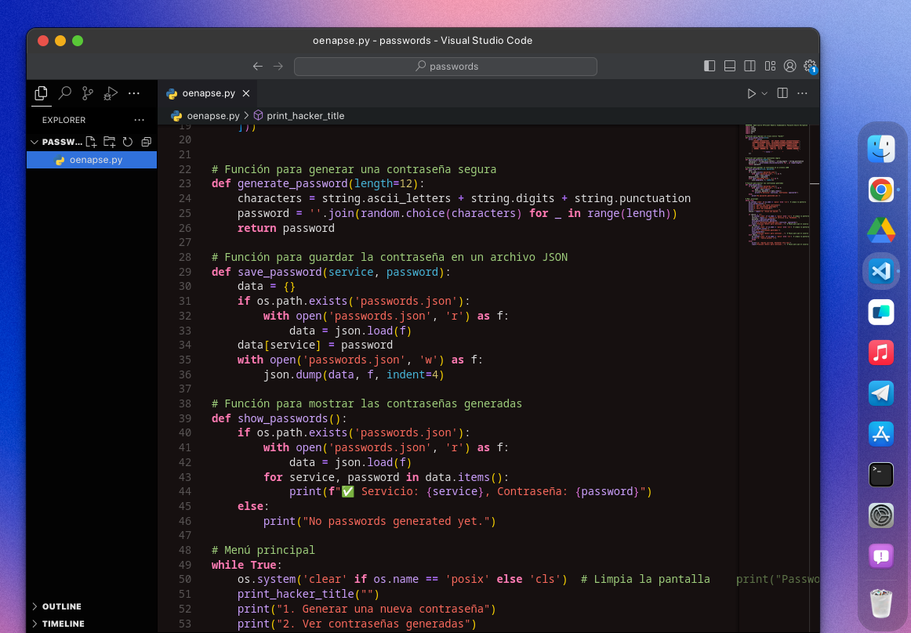

# OENAPSE: Generador de Contraseñas Numéricas Alfanuméricas Seguras y Eficientes



OENAPSE es un generador de contraseñas open-source que combina seguridad y eficiencia para crear contraseñas numéricas y alfanuméricas seguras. El proyecto está diseñado para ser simple y fácil de usar, y guarda las contraseñas generadas en un archivo JSON para su posterior consulta.

## Librerías Usadas

El proyecto utiliza las siguientes librerías de Python:
- `json`: Para manipular archivos JSON.
- `random`: Para generar contraseñas aleatorias.
- `string`: Para obtener caracteres alfanuméricos y de puntuación.
- `emoji`: (Nota: Esta librería no se utiliza en el código actual, pero está importada en caso de futuras actualizaciones).
- `os`: Para limpiar la pantalla y manejar archivos.

## Instalación

Para clonar el repositorio y comenzar a usar OENAPSE, sigue estos pasos:


1. **Clona el repositorio:**

   ```bash
   git clone https://github.com/AugustMorales26/oenapse-secure-passgen.git

2. **Accede al directorio del proyecto:**

   ```bash
   cd oenapse

3. **Asegúrate de tener Python instalado en tu sistema(Linux,MacOS,Windows**

4. **Ejecuta el programa:**
 
   ```bash
   python oenapse.py

## Notas

- El archivo JSON `passwords.json` se crea automáticamente en el directorio del proyecto para almacenar las contraseñas generadas.
- Asegúrate de mantener este archivo en un lugar seguro ya que contiene contraseñas sensibles.

## Contribuciones

Si deseas contribuir al proyecto, por favor abre un [issue](https://github.com/AugustMorales26/oenapse-secure-passgen/issues) o un [pull request](https://github.com/AugustMorales26/oenapse-secure-passgen/pulls) en el repositorio de GitHub.

## Licencia

Este proyecto está licenciado bajo la Licencia MIT. Consulta el archivo [LICENSE](LICENSE) para más detalles.

